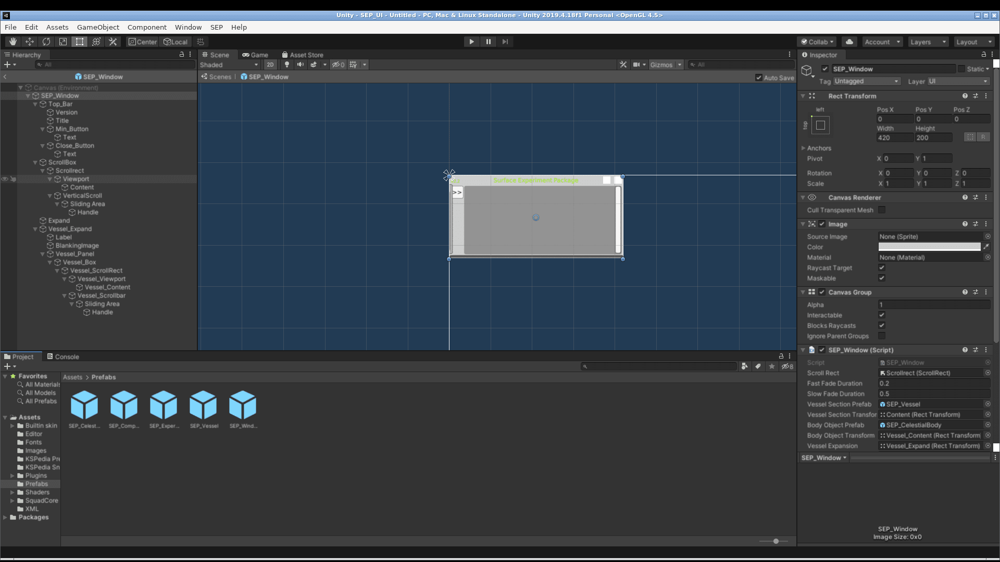

# ksp-moddev

> *"Unity 2019.4.18f1 installed. No kerbals were harmed. Several were mildly
> inconvenienced by the lack of snacks."*
> — Kerbal Institute of Development Environments

Building a mod for **Kerbal Space Program 1.12** means running Unity
**2019.4.18f1**, exactly that version and no other. That usually means cluttering
your system with a six-year-old editor, a Hub that wants to manage your life, and
a PartTools package whose official download link has left the Kerbin sphere of
influence.

**ksp-moddev** puts all of that in a Docker container instead, the way Wernher
would: strapped to a single stage, fully contained, and with only a small chance
of spontaneous disassembly.

- 🚀 **Unity 2019.4.18f1**, with Linux and Windows build targets. Asset bundles
  that KSP 1.8+ can actually load.
- 🧑‍🚀 **A full desktop in your browser.** noVNC, no GPU required, works over SSH
  from the other side of the Mun.
- 🔧 **Squad's official PartTools for 1.12**, rescued from the Internet Archive
  and checked by SHA-256, since the original link went on a one-way trip in 2025.
- 🛠️ **.NET SDK** for building plugin DLLs against your own copy of the game.
- 🧹 **Nothing installed on your system.** When you're done, `docker compose down`
  and it's like it never happened. Unlike Jeb's last landing.

It was built to rescue a real mod: [Surface Experiment Pack](https://github.com/CobaltWolf/Surface-Experiment-Pack),
whose 2016 asset bundles broke on KSP 1.8+. See [docs/rebuild-old-bundles.md](docs/rebuild-old-bundles.md)
for how that went. Spoiler: fewer explosions than expected.



---

## Requirements

- **x86_64** host with Docker. Linux works natively; on Windows and macOS, use
  Docker Desktop. Apple Silicon Macs are not supported, because the Unity editor
  in the image is x86_64 only.
- About **12 GB** of disk for the image, plus Unity's caches.
- Your own copy of **KSP 1.12**. Only `KSP_Data/Managed/*.dll` is read, to build
  plugins against.
- A free **Unity ID**, for the Personal license.

## Quick start

```sh
git clone https://github.com/celino/ksp-moddev.git && cd ksp-moddev
cp .env.example .env          # set KSP_GAME (and KSP_WORK, PUID/PGID if needed)
docker compose build          # ~10 min; pulls the Unity base image from GameCI
docker compose run --rm moddev moddev-selftest
docker compose up -d
```

Open <http://localhost:6080/vnc.html> and click **Connect**. The port only listens
on `127.0.0.1`. From another machine, open a tunnel with
`ssh -L 6080:localhost:6080 <docker-host>` and use the same address.

**First time:** activate the Unity Personal license by following
[docs/license.md](docs/license.md). It takes about 5 minutes and is done once.

Right-click the desktop for the menu (Terminal, Unity Hub, Unity Editor, Firefox).
For a shell from the host:

```sh
docker compose exec -u modder moddev bash
```

| command | what it does |
|---|---|
| `unity-gui /work/<project>` | opens the editor on a project |
| `unityhub-gui` | opens Unity Hub (only needed for the license) |
| `moddev-license` | shows whether a license is activated |
| `fetch-parttools` | downloads PartTools into `/opt/parttools` |
| `moddev-selftest` | checks the image |

## Configuration (`.env`)

| variable | default | purpose |
|---|---|---|
| `KSP_GAME` | *(required)* | your KSP 1.12 install, mounted read-only at `/ksp` |
| `KSP_WORK` | `./work` | your mod repos, mounted at `/work` |
| `PUID` / `PGID` | `1000` | owner of the files in `KSP_WORK` (`id -u`, `id -g`) |
| `VNC_PASSWORD` | *(empty)* | password for the desktop. Set one if you expose the port beyond `127.0.0.1` |
| `MODDEV_PORT` | `6080` | local port for noVNC |
| `MODDEV_GEOMETRY` | `1920x1080x24` | size of the virtual screen |

Volumes: `home` holds the Unity license, Hub config and caches; `parttools` holds
the downloaded package. `docker compose down -v` deletes both, license included.

## Using PartTools

`fetch-parttools` downloads `PartTools_PackageForModders.unitypackage` (the 2021
release for KSP 1.12) into `/opt/parttools`. To add it to a project, go to
*Assets → Import Package → Custom Package…*.

> **Watch out when upgrading an old project.** If the project already contains
> `Assets/Plugins/KSPAssets/KSPAssets.dll` and `KSPAssetCompiler.dll` from an older
> PartTools, importing the package does **not** replace them, because they have
> the same GUIDs. The old compiler then fails in Unity 2019 with
> `MissingMethodException: BuildPipeline.BuildAssetBundles(string, AssetBundleBuild[], BuildAssetBundleOptions)`.
> Copy the two DLLs and their `.meta` files from the package by hand. Also delete
> any old `PartTools.dll` outside `Assets/PartTools`. Details are in
> [docs/rebuild-old-bundles.md](docs/rebuild-old-bundles.md).

## Building a plugin DLL

Use an SDK-style project targeting `net48` that references the game's DLLs in `/ksp`:

```xml
<Project Sdk="Microsoft.NET.Sdk">
  <PropertyGroup><TargetFramework>net48</TargetFramework><LangVersion>7.3</LangVersion></PropertyGroup>
  <ItemGroup>
    <PackageReference Include="Microsoft.NETFramework.ReferenceAssemblies" Version="1.0.3" PrivateAssets="all" />
    <Reference Include="Assembly-CSharp"><HintPath>/ksp/KSP_Data/Managed/Assembly-CSharp.dll</HintPath><Private>false</Private></Reference>
    <Reference Include="UnityEngine.CoreModule"><HintPath>/ksp/KSP_Data/Managed/UnityEngine.CoreModule.dll</HintPath><Private>false</Private></Reference>
  </ItemGroup>
</Project>
```

Then run `dotnet build -c Release`.

## Troubleshooting

| symptom | cause / fix |
|---|---|
| KSP log: *"The AssetBundle '…' can't be loaded because it was not built with the right version or build target"* | The bundle was built with an older Unity. Rebuild it here. A bundle built for `StandaloneWindows64` also loads on Linux (tested on KSP 1.12.5). |
| The editor shows only an **"Install Unity Hub"** window | No valid license. See [docs/license.md](docs/license.md). |
| The Hub doesn't react after signing in | The `unityhub://` callback got lost. See the fallback in [docs/license.md](docs/license.md). |
| `The font … could not be imported because the file is empty` | Some old projects ship empty font files (usually proprietary fonts left out). If your UI swaps text for KSP's TextMeshPro at runtime, you can ignore it. |
| Console on project open: *"Could not load signature of KSPFontAsset… 'TextMeshPro-2017.3-1.0.56-Runtime'"* and *"Unloading broken assembly …/KSPAssetCompiler.dll"* | Comes from Squad's 1.12 PartTools itself: the compiler references a TextMeshPro DLL from the KSP 1.4 era. Bundle building (including KSPedia) still works; only TextMeshPro font assets can't be compiled. |
| Files in `/work` are owned by the wrong user | Set `PUID`/`PGID` in `.env` to the owner of your repos. |
| The editor is slow | It renders on the CPU (llvmpipe). Fine for UI and asset work, not for admiring shaders. |

## Licenses

The scripts and Dockerfile in this repo are MIT. The Unity Editor is under
Unity's terms (the Personal license needs activation with your own Unity ID), and
the base image comes from [GameCI](https://game.ci). PartTools and the KSP DLLs
belong to Squad/Take-Two and are not redistributed here. This project is not
affiliated with Squad, Take-Two, Private Division or Unity. Any resemblance to a
functioning space program is purely coincidental.
