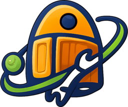
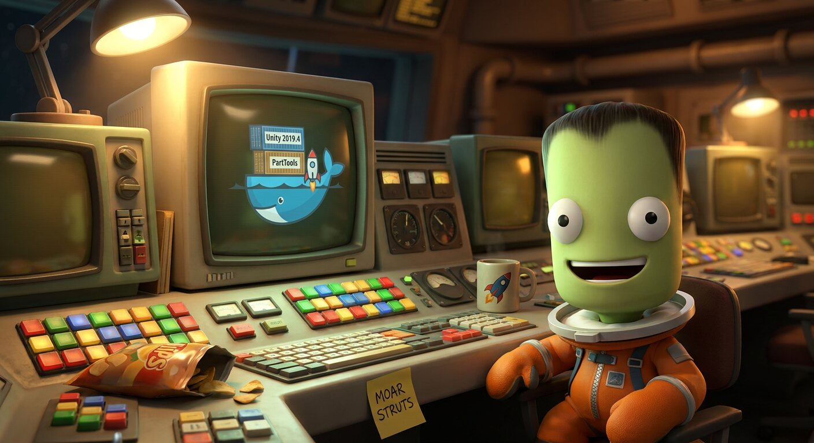
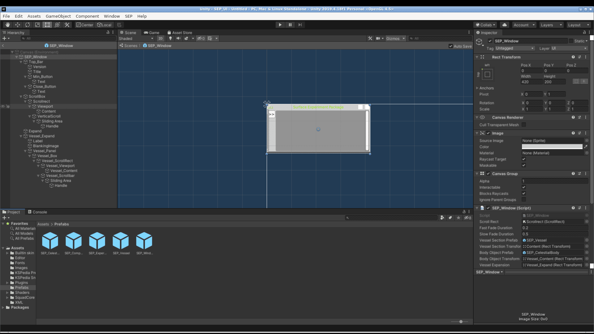

<h1> ksp-moddev</h1>

<p>
  
  
  
  
</p>



> *"Unity 2019.4.18f1 installed. No kerbals were harmed. Several were mildly
> inconvenienced by the lack of snacks."*
> — Kerbal Institute of Development Environments

Building a mod for **Kerbal Space Program 1.12** means running Unity
**2019.4.18f1**, exactly that version and no other. That usually means cluttering
your system with a six-year-old editor, a Hub that wants to manage your life, and
a PartTools package whose official download link has left the Kerbin sphere of
influence.

**ksp-moddev** puts all of that in a Docker container instead, the way Wernher
would: strapped to a single stage, fully contained, and with only a small chance
of spontaneous disassembly.

- 🚀 **Unity 2019.4.18f1**, with Linux and Windows build targets. Asset bundles
  that KSP 1.8+ can actually load.
- 🧑‍🚀 **A full desktop in your browser.** noVNC, no GPU required, works over SSH
  from the other side of the Mun.
- 🔧 **Squad's official PartTools for 1.12**, rescued from the Internet Archive
  and checked by SHA-256, since the original link went on a one-way trip in 2025.
- 🛠️ **.NET SDK** for building plugin DLLs against your own copy of the game.
- 🧹 **Nothing installed on your system.** When you're done, `docker compose down`
  and it's like it never happened. Unlike Jeb's last landing.

It was built to rescue a real mod: [Surface Experiment Pack](https://github.com/CobaltWolf/Surface-Experiment-Pack),
whose 2016 asset bundles broke on KSP 1.8+. See [docs/rebuild-old-bundles.md](docs/rebuild-old-bundles.md)
for how that went. Spoiler: fewer explosions than expected.



---

## Requirements

- **x86_64** host with Docker. Linux works natively; on Windows and macOS, use
  Docker Desktop. Apple Silicon Macs are not supported, because the Unity editor
  in the image is x86_64 only.
- About **12 GB** of disk for the image, plus Unity's caches.
- Your own copy of **KSP 1.12**. Only `KSP_Data/Managed/*.dll` is read, to build
  plugins against.
- A free **Unity ID**, for the Personal license.

## Quick start

```sh
git clone https://github.com/celino/ksp-moddev.git && cd ksp-moddev
cp .env.example .env          # set KSP_GAME (and KSP_WORK, PUID/PGID if needed)
docker compose build          # ~10 min; pulls the Unity base image from GameCI
docker compose run --rm moddev moddev-selftest
docker compose up -d
```

Open <http://localhost:6080/vnc.html> and click **Connect**. The port only listens
on `127.0.0.1`. From another machine, open a tunnel with
`ssh -L 6080:localhost:6080 <docker-host>` and use the same address.

**First time:** activate the Unity Personal license by following
[docs/license.md](docs/license.md). It takes about 5 minutes and is done once.

Right-click the desktop for the menu (Terminal, Unity Hub, Unity Editor, Firefox).
For a shell from the host:

```sh
docker compose exec -u modder moddev bash
```

| command | what it does |
|---|---|
| `unity-gui /work/<project>` | opens the editor on a project |
| `unityhub-gui` | opens Unity Hub (only needed for the license) |
| `moddev-license` | shows whether a license is activated |
| `fetch-parttools` | downloads PartTools into `/opt/parttools` |
| `moddev-selftest` | checks the image |
| `moddev-headless` | runs KSP to the main menu without a screen and summarizes the log |
| `moddev-logsummary <log>` | groups the exceptions and errors in a `KSP.log` or `Player.log` |
| `moddev-ab` | runs the game twice, with and without your change, and compares the logs |
| `moddev-csproj <x.csproj>` | makes a mod's old Visual Studio project build here |
| `moddev-checklist <steps.md>` | turns written steps into a page to tick off while you test |

## Configuration (`.env`)

| variable | default | purpose |
|---|---|---|
| `KSP_GAME` | *(required)* | your KSP 1.12 install, mounted read-only at `/ksp` |
| `KSP_WORK` | `./work` | your mod repos, mounted at `/work` |
| `PUID` / `PGID` | `1000` | owner of the files in `KSP_WORK` (`id -u`, `id -g`) |
| `VNC_PASSWORD` | *(empty)* | password for the desktop. Set one if you expose the port beyond `127.0.0.1` |
| `MODDEV_PORT` | `6080` | local port for noVNC |
| `MODDEV_GEOMETRY` | `1920x1080x24` | size of the virtual screen |

Volumes: `home` holds the Unity license, Hub config and caches; `parttools` holds
the downloaded package. `docker compose down -v` deletes both, license included.

## Using PartTools

`fetch-parttools` downloads `PartTools_PackageForModders.unitypackage` (the 2021
release for KSP 1.12) into `/opt/parttools`. To add it to a project, go to
*Assets → Import Package → Custom Package…*.

> **Watch out when upgrading an old project.** If the project already contains
> `Assets/Plugins/KSPAssets/KSPAssets.dll` and `KSPAssetCompiler.dll` from an older
> PartTools, importing the package does **not** replace them, because they have
> the same GUIDs. The old compiler then fails in Unity 2019 with
> `MissingMethodException: BuildPipeline.BuildAssetBundles(string, AssetBundleBuild[], BuildAssetBundleOptions)`.
> Copy the two DLLs and their `.meta` files from the package by hand. Also delete
> any old `PartTools.dll` outside `Assets/PartTools`. Details are in
> [docs/rebuild-old-bundles.md](docs/rebuild-old-bundles.md).

## Building a plugin DLL

Use an SDK-style project targeting `net48` that references the game's DLLs in `/ksp`:

```xml
<Project Sdk="Microsoft.NET.Sdk">
  <PropertyGroup><TargetFramework>net48</TargetFramework><LangVersion>7.3</LangVersion></PropertyGroup>
  <ItemGroup>
    <PackageReference Include="Microsoft.NETFramework.ReferenceAssemblies" Version="1.0.3" PrivateAssets="all" />
    <Reference Include="Assembly-CSharp"><HintPath>/ksp/KSP_Data/Managed/Assembly-CSharp.dll</HintPath><Private>false</Private></Reference>
    <Reference Include="UnityEngine.CoreModule"><HintPath>/ksp/KSP_Data/Managed/UnityEngine.CoreModule.dll</HintPath><Private>false</Private></Reference>
  </ItemGroup>
</Project>
```

Then run `dotnet build -c Release`.

**Someone else's mod, with an old project?** Many KSP mods ship a Visual Studio
project that points at `C:\Program Files (x86)\Steam\...` or `$(KSPDIR)`, runs `.bat`
files after the build and targets .NET 3.5. `moddev-csproj` leaves that project alone
and writes a new one (in `./build-<name>` by default) with the same source files,
every reference looked up in your game by file name, and the projects it depends on
converted too:

```sh
moddev-csproj --build /work/SomeMod/Source/SomeMod.csproj
```

Projects that already use KSPBuildTools or Krafs.Publicizer keep them, pointed at
your game. With `--build`, a reference the compiler still asks for (CS0012, or a
Unity type that moved to a module, CS1069) is added and the build retried. What it
can't carry over, such as post-build steps or a version number generated by a T4
template, is listed as a note.

## Testing a mod without opening the game

`moddev-headless` starts KSP on a virtual screen, waits for the main menu (or any
line you choose in `KSP.log`), stops the game and writes a summary of the log. Your
install is never modified: it is mirrored once into a cache in the `home` volume
(as big as your install; later runs only copy what changed), and each run gets a
scratch copy made of hardlinks to that cache. Your changes only go into that copy.

```sh
# Does my mod load cleanly?
moddev-headless --add /work/MyMod/GameData/MyMod --out runs/mymod

# Stop at your own log line instead of the main menu, with a save loaded by your test addon
moddev-headless --save mytest --add /work/MyProbe --until '\[MyProbe\] done' --timeout 1800
```

To show what a change does, `moddev-ab` runs the game twice and compares the logs.
Options starting with `--a-` or `--b-` go to one run only; the rest go to both:

```sh
moddev-ab --b-put /work/MyMod/bin/MyMod.dll=GameData/MyMod/Plugins/MyMod.dll --out runs/fix
```

`runs/fix/compare.md` lists the counts that changed, exceptions first. Errors logged
every frame always differ a little between two runs, so changes under 15% are only
counted (`moddev-logsummary --compare --all` lists them).

`moddev-logsummary KSP.log` works on any log, `Player.log` from your own game
included: exceptions grouped by type and by the mod that threw them, exceptions
inside GameEvents handlers, repeated `[ERR]` lines and assemblies that failed to
load. Add `--since HH:MM:SS` to read only from a given moment. Loading to the main
menu takes a few minutes with a large mod list, since everything renders on the CPU.

## Working with an AI assistant

Most of these tools were made so an AI coding assistant can do the tedious part of
fixing a mod (reading a 50 MB log, building someone else's project, running the
game twice to compare) while you keep the parts that need a person: deciding,
reviewing, and playing. [AGENTS.md](AGENTS.md) tells an assistant how to use them
and what not to do. The short version: **you decide, and you are responsible for
what ships.** The assistant never commits without your explicit approval of each
commit, every feature or fix gets a manual test by you before it is committed, it
never touches your install, and it never drives the Unity Hub.

Claude Code users get a ready skill in `.claude/skills/ksp-mod-fix/`.
[docs/ai-workflow.md](docs/ai-workflow.md) follows one real fix from the first log
to the before/after numbers, mistakes included.

For what only you can do, in the Unity editor or in the game, the assistant writes
the steps and `moddev-checklist` turns them into a page you tick off, from your phone
if you like. Each step says what to do and why; you mark it ok, odd, broken or
skipped, add a note, and paste the results back. Examples are in
[docs/examples/](docs/examples/).

## Troubleshooting

| symptom | cause / fix |
|---|---|
| `moddev-headless`: "symlink has no referent" | a mod in your install is a symlink to a folder outside it. Mount that folder at the same path, e.g. `-v /path/to/mods:/path/to/mods:ro` |
| KSP log: *"The AssetBundle '…' can't be loaded because it was not built with the right version or build target"* | The bundle was built with an older Unity. Rebuild it here. A bundle built for `StandaloneWindows64` also loads on Linux (tested on KSP 1.12.5). |
| The editor shows only an **"Install Unity Hub"** window | No valid license. See [docs/license.md](docs/license.md). |
| The Hub doesn't react after signing in | The `unityhub://` callback got lost. See the fallback in [docs/license.md](docs/license.md). |
| `The font … could not be imported because the file is empty` | Some old projects ship empty font files (usually proprietary fonts left out). If your UI swaps text for KSP's TextMeshPro at runtime, you can ignore it. |
| Console on project open: *"Could not load signature of KSPFontAsset… 'TextMeshPro-2017.3-1.0.56-Runtime'"* and *"Unloading broken assembly …/KSPAssetCompiler.dll"* | Comes from Squad's 1.12 PartTools itself: the compiler references a TextMeshPro DLL from the KSP 1.4 era. Bundle building (including KSPedia) still works; only TextMeshPro font assets can't be compiled. |
| Files in `/work` are owned by the wrong user | Set `PUID`/`PGID` in `.env` to the owner of your repos. |
| The editor is slow | It renders on the CPU (llvmpipe). Fine for UI and asset work, not for admiring shaders. |

## How this was made

Like any respectable space program, this one has a flight director and an intern.
I'm the flight director. The intern is Claudinho, my AI assistant, who works fast,
never sleeps and has never once asked for snacks.

1. **Flight plan.** We talk the plan over, and nothing gets built until I approve it.
2. **Assembly.** The intern builds most of it and runs the automated checks.
3. **Inspection.** I review every change and test it by hand, on a real KSP install.
   A few lines I had to write myself, because Claudinho just couldn't get them.
4. **Repeat** 2 and 3 until every requirement I set is met. Only then do we launch.

Anything that still blows up on the pad is on me. Please report it in the
[issues](https://github.com/celino/ksp-moddev/issues).

## Credits

- **[GameCI](https://game.ci)**, for the Unity images that let a 2019 editor live
  happily in a container.
- **Squad**, for PartTools, and the **[Internet Archive](https://archive.org)**, for
  catching it on its way out of orbit.
- **AlbertKermin** and **CobaltWolf**, for
  [Surface Experiment Pack](https://github.com/CobaltWolf/Surface-Experiment-Pack): the
  mod whose rescue started all this.
- **Claudinho**, my AI assistant (Claude, by Anthropic), who wrote most of the
  Dockerfile and the scripts and only asked once whether the container would go
  faster with more boosters. He did convince Jeb, though, and it took a while to
  talk Jeb out of it.
  Every line was reviewed and tested by Evandro, who is the one responsible for all
  of it, mistakes included.

## Licenses

The scripts and Dockerfile in this repo are MIT. The Unity Editor is under
Unity's terms (the Personal license needs activation with your own Unity ID), and
the base image comes from [GameCI](https://game.ci). PartTools and the KSP DLLs
belong to Squad/Take-Two and are not redistributed here. This project is not
affiliated with Squad, Take-Two, Private Division or Unity. Any resemblance to a
functioning space program is purely coincidental.

---

<sub>Made by Evandro, a.k.a. *Fogueteiro da Holanda* 🇧🇷 🇳🇱 ·
[GitHub](https://github.com/celino) · [Buy me a coffee](https://buymeacoffee.com/fogueteiro_da_holanda)</sub>
