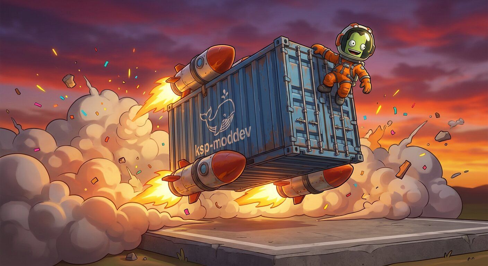

# Rebuilding an old mod's asset bundles for KSP 1.8+



KSP 1.8 moved to Unity 2019.4, and it refuses asset bundles built with older
Unity versions:

```
The AssetBundle 'sep_prefab' can't be loaded because it was not built with the right version or build target.
```

The mod's code still loads, but anything that lives in a bundle doesn't:
windows, KSPedia pages, custom shaders. This is the recipe we used for
[Surface Experiment Pack](https://github.com/CobaltWolf/Surface-Experiment-Pack),
whose Unity project was last opened in Unity 5.2.4f1 in 2016.

## 1. Find out how each bundle was built

KSP mods use two kinds of bundles, and they are built differently:

| kind | how it's loaded | how to build it |
|---|---|---|
| plain Unity bundle (often no extension) | the mod's code calls `AssetBundle.LoadFromFile(...)` | `BuildPipeline.BuildAssetBundles`, usually from a small editor script |
| `.ksp` bundle (KSPedia, parts, shaders) | KSP's own `AssetLoader` at startup | *KSPAssets → Asset Compiler* (from PartTools) |

Search the mod's source for `LoadFromFile`, and the Unity project for
`Assets/**/*_bundle.xml` (KSPAssets bundle definitions).

## 2. Prepare the project (on a new git branch)

1. **Delete `Library/`.** If it's committed, untrack it and add a `.gitignore`.
   The old cache gets in the way of the upgrade.
2. **Remove the old PartTools** (for example `Assets/Lib/PartTools*.dll`), if the
   prefabs don't reference it.
3. Open the project with `unity-gui /work/<path-to-project>` and accept
   **Continue** in "Opening Project in Non-Matching Editor Installation". An empty
   font file error is usually harmless (see the README's troubleshooting).
4. Run `fetch-parttools` and import `/opt/parttools/PartTools_PackageForModders.unitypackage`.
5. **Check that KSPAssets was actually replaced.** Compare
   `Assets/Plugins/KSPAssets/KSPAssets.dll` with the package's copy. If it's still
   the old one, copy both DLLs and their `.meta` files by hand. The old `.meta`
   may even keep the DLL disabled in the editor.

## 3. Build the plain bundles with an explicit list

Relying on the `assetBundleName` tags can split things the mod never loads into
separate bundles. SEP's window icons were tagged `sep_images`, a bundle SEP
never loaded. Listing the bundle explicitly pulls every dependency in:

```csharp
// Assets/Editor/BundleBuilder.cs
using System.IO;
using UnityEditor;

public static class BundleBuilder
{
    [MenuItem("Mod/Build bundle")]
    public static void Build()
    {
        string outDir = "AssetBundles/StandaloneWindows64";
        Directory.CreateDirectory(outDir);
        var builds = new[] {
            new AssetBundleBuild {
                assetBundleName = "my_prefabs",
                assetNames = new[] { "Assets/Prefabs/MyWindow.prefab" },
            },
        };
        BuildPipeline.BuildAssetBundles(outDir, builds,
            BuildAssetBundleOptions.ChunkBasedCompression, BuildTarget.StandaloneWindows64);
    }
}
```

Check the generated `.manifest`: `Dependencies: []` means the bundle stands alone.

A bundle built for `StandaloneWindows64` loaded fine on KSP 1.12.5 on Linux (UI
prefabs, no custom shaders). Bundles with shaders may need one build per platform.

## 4. Build the `.ksp` bundles

Go to *KSPAssets → Asset Compiler*, select the bundle definition and click **Build**.
The 1.12 compiler writes the file **without** the `.ksp` extension (for example
`AssetBundles/sep_kspedia`). Rename it when copying it to `GameData`, because KSP
only scans for `*.ksp`.

## 5. Test without leaving your chair

KSP doesn't need a GPU to reach the main menu, and the image can run it.
**Back up `settings.cfg` and `KSP.log` first**, since the run overwrites them.
The temporary `HOME` keeps Unity's player prefs for this run out of the container's home volume:

```sh
docker run --rm --shm-size 2g -e PUID=$(id -u) -e PGID=$(id -g) -v "$KSP_GAME":/game \
  ksp-moddev:2019.4.18f1 bash -c 'export HOME=/tmp/h; mkdir -p $HOME; cd /game && \
  timeout 1800 xvfb-run -a -s "-screen 0 1280x720x24" ./KSP.x86_64 -force-glcore'
```

Watch `KSP.log`. Success looks like `AssetLoader: Loaded mod bundle '<name>'` and
no *"can't be loaded"* lines. Loading a save is possible too, but checking what a
window looks like still takes a human.
